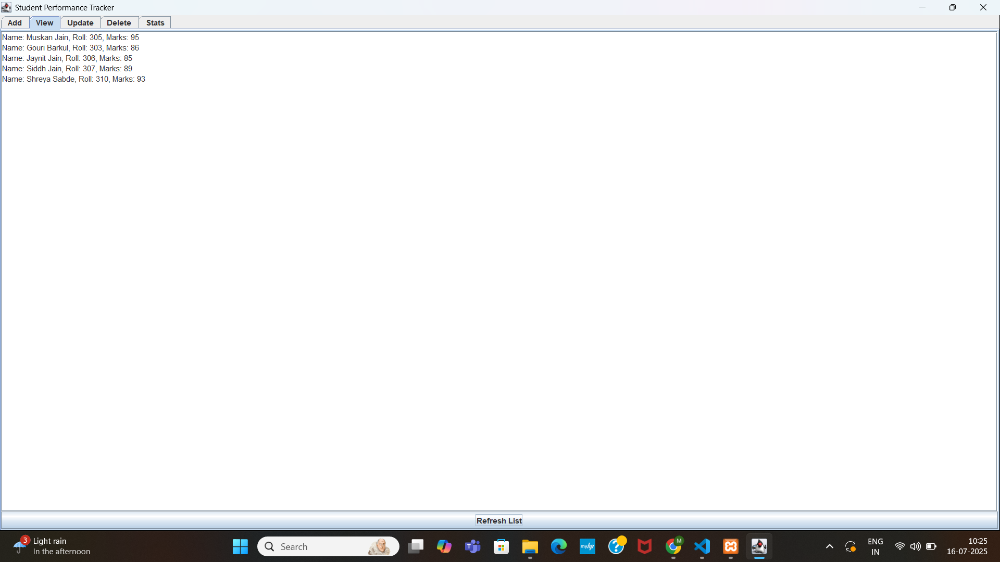

# 🎓 Student Performance Tracker

A clean and lightweight **Java Swing desktop application** to manage, track, and analyze student academic performance — without any database or internet connection.

---

## 📌 About The Project

Student Performance Tracker is designed for teachers, students, and small institutions to manage student records easily.

### Key Functionalities
- Maintain student records (Roll No, Name, Marks)
- Analyze class performance
- Store data locally using file handling
- Find topper and average marks

---

## 🖥️ Screenshot



> Make sure `Screenshot.png` is present in the same folder as README.

---

## ✨ Features

### ➕ Add Student
Add new students with Roll Number, Name, and Marks.

### 👁️ View Students
Display all student records in a table.

### 🔄 Update Student
Modify student details using Roll Number.

### ❌ Delete Student
Remove a student record from the system.

### 🏆 Show Topper
Find the student with highest marks.

### 📊 Average Marks
Calculate class average instantly.

---

## 🛠️ Technologies Used

- Java (Core Language)
- Java Swing (GUI)
- File Handling (Data Storage)
- OOP (Code Structure)

---

## 📂 How to Run

### Prerequisites
- Java JDK 8+
- Any Java IDE (IntelliJ / Eclipse / NetBeans)
- Git

### Steps

1. Clone the repository:
   ```
   git clone https://github.com/yourusername/StudentPerformanceTracker.git
   ```

2. Navigate to project folder:
   ```
   cd StudentPerformanceTracker
   ```

3. Compile:
   ```
   javac -d out src/*.java
   ```

4. Run:
   ```
   java -cp out Main
   ```

---

## 📁 Project Structure

```
StudentPerformanceTracker/
|
|-- src/
|   |-- Main.java
|   |-- Student.java
|   |-- StudentManager.java
|   |-- FileHandler.java
|
|-- web-trcker/
|   |-- students.dat
|
|-- Screenshot.png
|-- README.md
|-- LICENSE
```

---

## 🧠 Concepts Covered

- Classes & Objects  
- Encapsulation  
- File Handling  
- ArrayList / Collections  
- Swing GUI  
- Event Handling  

---

## 🚀 Future Improvements

- Search student by name  
- Export to CSV/PDF  
- Add grading system  
- Graphical analytics  
- Admin login  
- Dark mode  

---

## 🤝 Contributing

1. Fork the project  
2. Create a branch  
3. Commit changes  
4. Push and open PR  

---

⭐ If you found this useful, give it a star!
